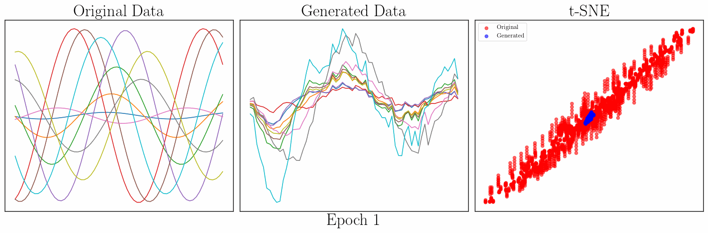

<div align="center">

</div>

<h3 align="center">
Time Series Generative Modeling (TSGM)
</h3>

<p align="center">
Create and evaluate synthetic time series datasets effortlessly
</p>

<div align="center">

[](https://colab.research.google.com/drive/1l2VB6eUwvrxyu8iB30faGiQM5AKthc82?usp=sharing)
[](https://pypi.org/project/tsgm/)
[](https://github.com/AlexanderVNikitin/tsgm/actions?query=workflow%3ATests+branch%3Amain)
[](https://www.python.org/downloads/release/python-380/)
[](https://codecov.io/gh/AlexanderVNikitin/tsgm)
[](https://arxiv.org/abs/2305.11567)

</div>

<p align="center">
  <a href="#jigsaw-get-started">Get Started</a> •
  <a href="#anchor-tutorials">Tutorials</a> •
  <a href="#art-augmentations">Augmentations</a> •
  <a href="#hammer-generators">Generators</a> •
  <a href="#chart_with_upwards_trend-metrics">Metrics</a> •
  <a href="#floppy_disk-datasets">Datasets</a> •
  <a href="#hammer_and_wrench-contributing">Contributing</a> •
  <a href="#mag-citing">Citing</a> 
</p>


## :jigsaw: Get Started

TSGM is an open-source framework for synthetic time series dataset generation and evaluation. 

<div align="center">

</div>

The framework can be used for creating synthetic datasets (see <a href="#hammer-generators">:hammer: Generators </a>), augmenting time series data (see <a href="#art-augmentations">:art: Augmentations </a>), evaluating synthetic data with respect to consistency, privacy, downstream performance, and more (see <a href="#chart_with_upwards_trend-metrics">:chart_with_upwards_trend: Metrics </a>), using common time series datasets (TSGM provides easy access to more than 140 datasets, see <a href="#floppy_disk-datasets">:floppy_disk: Datasets </a>).

We provide:
* [Documentation](https://tsgm.readthedocs.io/en/latest/) with a complete overview of the implemented methods,
* [Tutorials](https://github.com/AlexanderVNikitin/tsgm/tree/main/tutorials) that describe practical use-cases of the framework.


### Install TSGM

TSGM now supports Keras 3 with multiple backend options. Choose one of the following installation methods:

#### Option 1: With TensorFlow backend (default)
```bash
pip install tsgm[tensorflow]
```

#### Option 2: With PyTorch backend
```bash
pip install tsgm[torch]
```

#### Option 3: With both backends
```bash
pip install tsgm[all]
```

#### Option 4: Basic installation (you'll need to install a backend separately)
```bash
pip install tsgm
# Then install your preferred backend:
# For TensorFlow: pip install tensorflow tensorflow-probability
# For PyTorch: pip install torch torchvision
```

#### Backend Configuration
Set your preferred Keras backend using the environment variable:
```bash
# For TensorFlow backend
export KERAS_BACKEND=tensorflow

# For PyTorch backend  
export KERAS_BACKEND=torch

# For JAX backend (if available)
export KERAS_BACKEND=jax
```

#### M1 and M2 chips:
To install `tsgm` on Apple M1 and M2 chips:
```bash
# Install with TensorFlow backend
pip install tsgm[tensorflow]

# Or install with PyTorch backend
pip install tsgm[torch]
```

**Note for PyTorch users on M1/M2 chips:** Some operations may need CPU fallback on MPS devices. If you encounter MPS-related errors, set the environment variable:
```bash
export PYTORCH_ENABLE_MPS_FALLBACK=1
```


### Train your generative model
```python
import tsgm

# ... Define hyperparameters ...
# dataset is a tensor of shape n_samples x seq_len x feature_dim

# Zoo contains several prebuilt architectures: we choose a conditional GAN architecture
architecture = tsgm.models.architectures.zoo["cgan_base_c4_l1"](
    seq_len=seq_len, feat_dim=feature_dim,
    latent_dim=latent_dim, output_dim=0)
discriminator, generator = architecture.discriminator, architecture.generator

# Initialize GAN object with selected discriminator and generator
gan = tsgm.models.cgan.GAN(
    discriminator=discriminator, generator=generator, latent_dim=latent_dim
)
gan.compile(
    d_optimizer=keras.optimizers.Adam(learning_rate=0.0003),
    g_optimizer=keras.optimizers.Adam(learning_rate=0.0003),
    loss_fn=keras.losses.BinaryCrossentropy(from_logits=True),
)
gan.fit(dataset, epochs=N_EPOCHS)

# Generate 100 synthetic samples
result = gan.generate(100)
```

## :anchor: Tutorials

- [](https://colab.research.google.com/drive/1l2VB6eUwvrxyu8iB30faGiQM5AKthc82?usp=sharing) Introductory Tutorial [Getting started with TSGM](https://github.com/AlexanderVNikitin/tsgm/blob/main/tutorials/GANs/cGAN.ipynb)
- [](https://colab.research.google.com/drive/1frSnJQSsuPS3asgIkmcrNtX4Y7TIQI56?usp=sharing) Tutorial [Datasets in TSGM](https://github.com/AlexanderVNikitin/tsgm/blob/main/tutorials/Datasets.ipynb)
- [](https://colab.research.google.com/drive/1Vw9t4TlI1Nek_t6bMPyKcPPPqCiXfOK3?usp=sharing) Tutorial [Time Series Augmentations](https://github.com/AlexanderVNikitin/tsgm/blob/main/tutorials/augmentations.ipynb)
- [](https://colab.research.google.com/drive/1_jpGrPcwoSpB8eii8XW-spaikczdPqIQ?usp=sharing) Tutorial [Time Series Generation with VAEs](https://github.com/AlexanderVNikitin/tsgm/blob/main/tutorials/VAEs/VAE.ipynb)
- [](https://colab.research.google.com/drive/1rcN3pr8uglBEEOo4bTa1fvXgSMx1vKq9?usp=sharing) Tutorial [Conditional Time Series Generation with GANs](https://github.com/AlexanderVNikitin/tsgm/blob/main/tutorials/GANs/cGAN.ipynb)
- [](https://colab.research.google.com/drive/1hubtddSX94KyLzuCTwmU6pAFBgBeiEB-?usp=sharing) Tutorial [Evaluation of Synthetic Time Series Data](https://github.com/AlexanderVNikitin/tsgm/blob/main/tutorials/evaluation.ipynb)
- [](https://colab.research.google.com/drive/1SKD9hRi-ic27Wts9Qzkssjfe1z7o1NU4?usp=sharing) Tutorial [Model Selection](https://github.com/AlexanderVNikitin/tsgm/blob/main/tutorials/Model%20Selection.ipynb)
- [](https://colab.research.google.com/drive/1wpf9WeNVj5TkUcPF6EavVx-hUCOfyvUd?usp=sharing) Tutorial [Multiple GPUs or TPU with TSGM](https://github.com/AlexanderVNikitin/tsgm/blob/main/tutorials/Using%20Multiple%20GPUs%20or%20TPU.ipynb)

For more examples, see [our tutorials](./tutorials).

## :art: Augmentations
TSGM provides a number of time series augmentations.

| Augmentation  | Class in TSGM | Reference     |
| ------------- | ------------- | ------------- |
| Gaussian Noise / Jittering  | `tsgm.augmentations.GaussianNoise` | -  |        
| Slice-And-Shuffle  | `tsgm.augmentations.SliceAndShuffle` | - |
| Shuffle Features  | `tsgm.augmentations.Shuffle` | - |
| Magnitude Warping  | `tsgm.augmentations.MagnitudeWarping` | [Data Augmentation of Wearable Sensor Data for Parkinson’s Disease Monitoring using Convolutional Neural Networks](https://dl.acm.org/doi/pdf/10.1145/3136755.3136817) |
| Window Warping  | `tsgm.augmentations.WindowWarping` | [Data Augmentation for Time Series Classification using Convolutional Neural Networks](https://shs.hal.science/halshs-01357973/document) |
| DTW Barycentric Averaging  | `tsgm.augmentations.DTWBarycentricAveraging` | [A global averaging method for dynamic time warping, with applications to clustering.](https://www.sciencedirect.com/science/article/pii/S003132031000453X) |

## :hammer: Generators
TSGM implements several generative models for synthetic time series data.

| Method  | Link to docs | Type | Notes |
| ------------- | ------------- | ------------- | ------------- |
| Structural Time Series  | [sts.STS](https://tsgm.readthedocs.io/en/latest/modules/root.html#tsgm.models.sts.STS) | Data-driven | Great for modeling time series when prior knowledge is available (e.g., trend or seasonality).  |        
| GAN  | [GAN](https://tsgm.readthedocs.io/en/latest/modules/root.html#tsgm.models.cgan.GAN) | Data-driven | A generic implementation of GAN for time series generation. It can be customized with architectures for generators and discriminators. |
| WaveGAN  | [GAN](https://tsgm.readthedocs.io/en/latest/modules/root.html#tsgm.models.cgan.GAN) | Data-driven | WaveGAN is the model for audio synthesis proposed in [Adversarial Audio Synthesis](https://arxiv.org/abs/1802.04208). To use WaveGAN, set `use_wgan=True` when initializing the GAN class and use the `zoo["wavegan"]` architecture from the model zoo. |
| ConditionalGAN | [ConditionalGAN](https://tsgm.readthedocs.io/en/latest/modules/root.html#tsgm.models.cgan.ConditionalGAN) | Data-driven | A generic implementation of conditional GAN. It supports scalar conditioning as well as temporal one. |
| BetaVAE  | [BetaVAE](https://tsgm.readthedocs.io/en/latest/modules/root.html#tsgm.models.cvae.BetaVAE) | Data-driven | A generic implementation of Beta VAE for TS. The loss function is customized to work well with multi-dimensional time series. |
| cBetaVAE  | [cBetaVAE](https://tsgm.readthedocs.io/en/latest/modules/root.html#tsgm.models.cvae.cBetaVAE) | Data-driven | Conditional version of BetaVAE. It supports temporal a scalar condiotioning.|
| TimeGAN | [TimeGAN](https://tsgm.readthedocs.io/en/latest/modules/root.html#tsgm.models.timegan.TimeGAN) | Data-driven | TSGM implementation of TimeGAN from [paper](https://papers.nips.cc/paper_files/paper/2019/hash/c9efe5f26cd17ba6216bbe2a7d26d490-Abstract.html) |
| SineConstSimulator | [SineConstSimulator](https://tsgm.readthedocs.io/en/latest/modules/root.html#tsgm.simulator.SineConstSimulator) | Simulator-based | Simulator-based synthetic signal that switches between constant and periodics functions. |
| Lotka Volterra | [LotkaVolterraSimulator](https://tsgm.readthedocs.io/en/latest/modules/root.html#tsgm.simulator.LotkaVolterraSimulator) | Simulator-based | Simulator-based synthetic signal that switches between constant and periodics functions. |
| PdM Simulator | [PdMSimulator](https://tsgm.readthedocs.io/en/latest/modules/root.html#tsgm.simulator.PredictiveMaintenanceSimulator) | Simulator-based | Simulator of predictive maintenance with multiple pieces of equipment from [paper](https://arxiv.org/pdf/2206.11574) |

## :chart_with_upwards_trend: Metrics
TSGM implements many metrics for synthetic time series evaluation. Check Section 3 from [our paper for more detail on the evaluation of synthetic time series](https://arxiv.org/pdf/2305.11567).

| Metric  | Link to docs | Type | Notes |
| ------------- | ------------- | ------------- | ------------- |
| Distance in the space of summary statistics  | [tsgm.metrics.DistanceMetric](https://tsgm.readthedocs.io/en/latest/autoapi/tsgm/metrics/index.html#tsgm.metrics.DistanceMetric) | Distance | Calculates a set of summary statistics in the original and synthetic data, and measures the distance between those.  |        
| Maximum Mean Discrepancy (MMD)  | [tsgm.metrics.MMDMetric](https://tsgm.readthedocs.io/en/latest/autoapi/tsgm/metrics/index.html#tsgm.metrics.MMDMetric) | Distance | This metric calculated MMD between real and synthetic samples |
| Discriminative Score | [tsgm.metrics.DiscriminativeMetric](https://tsgm.readthedocs.io/en/latest/autoapi/tsgm/metrics/index.html#tsgm.metrics.DiscriminativeMetric) | Distance | The DiscriminativeMetric measures the discriminative performance of a model in distinguishing between synthetic and real datasets. |
| Demographic Parity Score | [tsgm.metrics.DemographicParityMetric](https://tsgm.readthedocs.io/en/latest/autoapi/tsgm/metrics/index.html#tsgm.metrics.DemographicParityMetric) | Fairness |  This metric assesses the difference in the distributions of a target variable among different groups in two datasets. Refer to [this paper](https://fairware.cs.umass.edu/papers/Verma.pdf) to learn more. |
| Predictive Parity Score | [tsgm.metrics.PredictiveParityMetric](https://tsgm.readthedocs.io/en/latest/autoapi/tsgm/metrics/index.html#tsgm.metrics.PredictiveParityMetric) | Fairness | This metric assesses the discrepancy in the predictive performance of a model among different groups in two datasets. Refer to [this paper](https://fairware.cs.umass.edu/papers/Verma.pdf) to learn more. |
| Privacy Membership Inference Attack Score  | [tsgm.metrics.PrivacyMembershipInferenceMetric](https://tsgm.readthedocs.io/en/latest/autoapi/tsgm/metrics/index.html#tsgm.metrics.PrivacyMembershipInferenceMetric) | Privacy | The metric measures the possibility of membership inference attacks.|
| Spectral Entropy  | [tsgm.metrics.EntropyMetric](https://tsgm.readthedocs.io/en/latest/autoapi/tsgm/metrics/index.html#tsgm.metrics.EntropyMetric) | Diversity | Calculates the spectral entropy of a dataset or tensor as a sum of individual entropies. |
| Shannon Entropy  | [tsgm.metrics.ShannonEntropyMetric](https://tsgm.readthedocs.io/en/latest/autoapi/tsgm/metrics/index.html#tsgm.metrics.ShannonEntropyMetric) | Diversity | Shannon Entropy calculated over the labels of a dataset. |
| Pairwise Distance  | [tsgm.metrics.PairwiseDistanceMetric](https://tsgm.readthedocs.io/en/latest/autoapi/tsgm/metrics/index.html#tsgm.metrics.PairwiseDistanceMetric) | Diversity | Measures pairwise distances in a set of time series. |
| Downstream Effectiveness | [tsgm.metrics.DownstreamPerformanceMetric](https://tsgm.readthedocs.io/en/latest/autoapi/tsgm/metrics/index.html#tsgm.metrics.DownstreamPerformanceMetric) | Downstream Effectiveness | The downstream performance metric evaluates the performance of a model on a downstream task. It returns performance gains achieved with the addition of synthetic data. |
| Qualitative Evaluation | [tsgm.utils.visualization](https://tsgm.readthedocs.io/en/latest/modules/root.html#module-tsgm.utils.visualization) | Qualitative | Various tools for visual assessment of a generated dataset. |


## :floppy_disk: Datasets
| Dataset | API                                               | Description     |
| - |---------------------------------------------------| ------------- |
| UCR Dataset | `tsgm.utils.UCRDataManager`                       | https://www.cs.ucr.edu/%7Eeamonn/time_series_data_2018/  |
| Mauna Loa | `tsgm.utils.get_mauna_loa()`                      | https://gml.noaa.gov/ccgg/trends/data.html |
| EEG & Eye state | `tsgm.utils.get_eeg()`                            | https://archive.ics.uci.edu/ml/datasets/EEG+Eye+State  |
| Power consumption dataset | `tsgm.utils.get_power_consumption()`              | https://archive.ics.uci.edu/ml/datasets/individual+household+electric+power+consumption  |
| Stock data | `tsgm.utils.get_stock_data(ticker_name)`          | Gets historical stock data from YFinance  |
| COVID-19 over the US | `tsgm.utils.get_covid_19()`                       | Covid-19 distribution over the US  |
| Energy Data (UCI) | `tsgm.utils.get_energy_data()`                    | https://archive.ics.uci.edu/ml/datasets/Appliances+energy+prediction  |
| MNIST as time series | `tsgm.utils.get_mnist_data()`                     | https://en.wikipedia.org/wiki/MNIST_database  |
| Samples from GPs | `tsgm.utils.get_gp_samples_data()`                | https://en.wikipedia.org/wiki/Gaussian_process |
| Physionet 2012 | `tsgm.utils.get_physionet2012()`                  | https://archive.physionet.org/pn3/challenge/2012/ |
| Synchronized Brainwave Dataset  | `tsgm.utils.get_synchronized_brainwave_dataset()` | https://www.kaggle.com/datasets/berkeley-biosense/synchronized-brainwave-dataset |

TSGM provides API for convenient use of many time-series datasets (currently more than 140 datasets). The comprehensive list of the datasets in the [documentation](https://tsgm.readthedocs.io/en/latest/guides/datasets.html)


## :hammer_and_wrench: Contributing
We appreciate all contributions. To learn more, please check [CONTRIBUTING.md](CONTRIBUTING.md).

#### For contributors
```bash
git clone github.com/AlexanderVNikitin/tsgm
cd tsgm
pip install -e .
```

Run tests:
```bash
python -m pytest
```

To check static typing:
```bash
mypy
```

## :computer: CLI
We provide two CLIs for convenient synthetic data generation:
- `tsgm-gd` generates data by a stored sample,
- `tsgm-eval` evaluates the generated time series.

Use `tsgm-gd --help` or `tsgm-eval --help` for documentation.

## :mag: Citing
If you find this repo useful, please consider citing our paper:
```
@article{
  nikitin2023tsgm,
  title={TSGM: A Flexible Framework for Generative Modeling of Synthetic Time Series},
  author={Nikitin, Alexander and Iannucci, Letizia and Kaski, Samuel},
  journal={arXiv preprint arXiv:2305.11567},
  year={2023}
}
```

## License
[Apache License 2.0](LICENSE)
