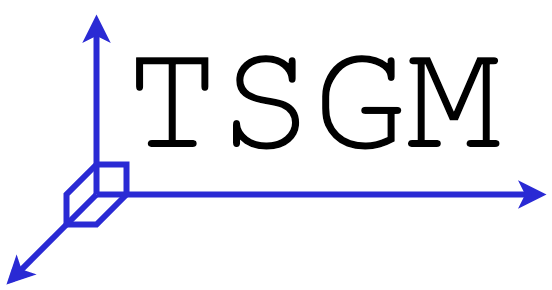

<div style="text-align:center">

</div>


# Time Series Generative Modeling Framework (TSGM)

[Documentation](https://tsgm.readthedocs.io/en/latest/) |
[Tutorials](https://github.com/AlexanderVNikitin/tsgm/tree/main/tutorials)

## About TSGM

TSGM is an open-source framework for synthetic time series generation.

The framework can be used for:
- creating synthetic data, using historical data, black-box models, or a combined approach,
- researching new approaches for synthetic data generation,
- comparison of different generative methods for time series.


## Getting started

We provide:
* [Documentation](https://tsgm.readthedocs.io/en/latest/) where we give complete overview of the implemented methods,
* [Tutorials](https://github.com/AlexanderVNikitin/tsgm/tree/main/tutorials) with tutorials that describe practical use-cases of the framework.


## Install TSGM
#### For contributors
```bash
git clone github.com/AlexanderVNikitin/tsgm
cd tsgm
make install
```

Run tests:
```bash
make test
```

To check static typing:
```bash
mypy
```

## Train your generative model
Here we provide the gist of the framework, for the completed examples see [our tutorials](./tutorials).
```python
import tsgm

# ... Define hyperparameters ...

dataset = _gen_dataset(seq_len, feature_dim, batch_size)
architecture = tsgm.models.architectures.zoo["cgan_base_c4_l1"](
    seq_len=seq_len, feat_dim=feature_dim,
    latent_dim=latent_dim, output_dim=0)
discriminator, generator = architecture.discriminator, architecture.generator

gan = tsgm.models.cgan.GAN(
    discriminator=discriminator, generator=generator, latent_dim=latent_dim
)
gan.compile(
    d_optimizer=keras.optimizers.Adam(learning_rate=0.0003),
    g_optimizer=keras.optimizers.Adam(learning_rate=0.0003),
    loss_fn=keras.losses.BinaryCrossentropy(from_logits=True),
)
gan.fit(dataset, epochs=N_EPOCHS)

result = gan.generate(10)
```

## Datasets
TSGM provides API for convenient use of many time-series datasets. The comprehensive list of the datasets in the [documentation](https://tsgm.readthedocs.io/en/latest/guides/datasets.html)

## Contributing
We appreciate all contributions. To learn more, please check [CONTRIBUTING.md](CONTRIBUTING.md).

## License
[Apache License 2.0](LICENSE)